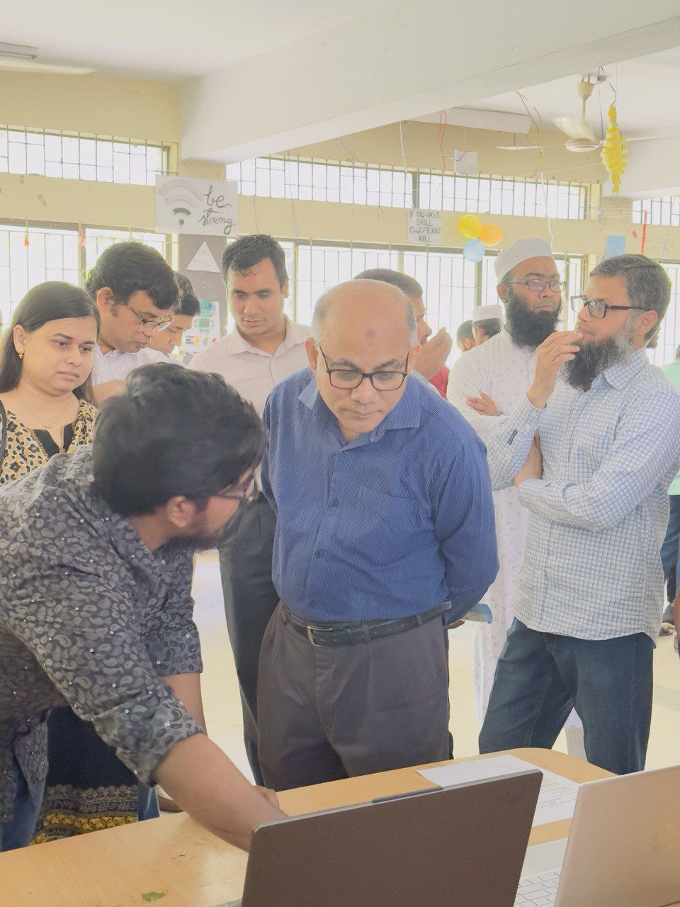

# 🎓 HSTU Alumni Employment Solutions (HAES)

> A dedicated job-finding platform that connects **Hajee Mohammad Danesh Science and Technology University (HSTU) alumni** with the next generation of professionals, while giving back to the HSTU student community.


---

## 📖 Table of Contents

- [About the Project](#-about-the-project)
- [✨ Features](#-features)
- [🚀 Live Showcase at HSTU CSE Fest](#-live-showcase-at-hstu-cse-fest)
- [🖼️ Screenshots](#-screenshots)
- [🛠️ Tech Stack](#-tech-stack)
- [📁 Project Structure](#-project-structure)
- [⚙️ Installation & Setup](#-installation--setup)
- [🗄️ Database Schema](#-database-schema)
- [📡 API Endpoints](#-api-endpoints)
- [🤝 Contributing](#-contributing)
- [📜 License](#-license)
- [👤 Author](#-author)

---

## 🧭 About the Project

**HSTU Alumni Employment Solutions (HAES)** is a web application built to strengthen the bond between HSTU alumni and current students. Alumni can post exclusive job openings from their companies, and students/graduates get first-hand access to opportunities that match their skills and interests.

Beyond the job board, the platform also serves as a **career resource hub**, offering job search tips, career advice, and networking pathways to help every HSTU alumnus and student pursue a fulfilling career.

### 🎯 Mission
> _"Help our alumni stay connected and give back to the university community while providing valuable opportunities to our current students."_

---

## ✨ Features

- 📋 **Job Board** — Browse all open positions posted by alumni in one centralized place.
- 🔎 **Job Detail Pages** — Each listing exposes the full responsibilities, requirements, salary, and currency.
- 📝 **Online Application Form** — Candidates apply directly with their full name, email, LinkedIn URL, education, experience, and resume link.
- ✅ **Application Confirmation Page** — Instant review of submitted data after applying.
- 📡 **JSON API** — Programmatic access to all jobs via a REST endpoint.
- 🎨 **Custom Glowing UI** — A custom Bootstrap-styled theme with animated "glow" elements.
- 📱 **Responsive Layout** — Bootstrap grid keeps the site usable on mobile, tablet, and desktop.
- 🔒 **MySQL over SSL** — Production-grade database connectivity via SQLAlchemy.

---

## 🚀 Live Showcase at HSTU CSE Fest

The project was **demoed at the HSTU CSE Fest** to the Hon'ble Vice-Chancellor and attendees as a working showcase of how alumni networking can drive student careers.

> _An interactive booth for HAES — alumni networking made real._

| 🏛️ Showcasing the Project | 🎪 At the CSE Fest |
| :---: | :---: |
|  |  |
| _Demonstrating HAES to the Hon'ble Vice-Chancellor_ | _Live demo at the HSTU CSE Fest_ |

| 📸 Showcasing HAES |
| :---: |
|  |
| _Another angle of the HAES showcase at the fest_ |

---

## 🖼️ Screenshots

> _All images are stored in the [`ss/`](./ss) directory._

| Section | Preview |
| --- | --- |
| **Project Showcase at CSE Fest** |  |
| **Showcasing to VC Sir** |  |
| **Fest Booth / Event** |  |

---

## 🛠️ Tech Stack

| Layer | Technology |
| --- | --- |
| **Language** | Python 3.10+ |
| **Web Framework** | [Flask 2.2.3](https://flask.palletsprojects.com/) |
| **ORM / DB Driver** | [SQLAlchemy 2.0.4](https://www.sqlalchemy.org/) with `pymysql` |
| **Database** | MySQL (accessed over SSL) |
| **WSGI Server (prod)** | [Gunicorn](https://gunicorn.org/) |
| **Frontend** | HTML5, Jinja2 templates, Bootstrap 5, custom CSS (glow effects, marquee text) |
| **Hosting / Dev Env** | [Replit](https://replit.com/) (`replit.nix` + `.replit`) |
| **Packaging** | Poetry (`pyproject.toml`) |

---

## 📁 Project Structure

```
hstu-alumni-employment-solutions/
├── app.py                    # Flask routes & app entry point
├── database.py               # SQLAlchemy engine + queries
├── pyproject.toml            # Poetry dependency manifest
├── poetry.lock               # Pinned dependency versions
├── requirements.txt          # Pip-compatible dependency list
├── replit.nix                # Replit Nix environment
├── .replit                   # Replit run configuration
├── LICENSE                   # MIT License
├── README.md                 # You are here
│
├── ss/                       # 📸 Screenshots from the CSE Fest showcase
│   ├── cse fest.jpg
│   ├── showcase to vc sir.jpg
│   └── showcase.jpg
│
├── static/                   # Static assets
│   ├── banner.jpg
│   ├── emp.jpg
│   └── icon.png
│
└── templates/                # Jinja2 templates
    ├── application_form.html     # Job application form
    ├── application_submitted.html  # Confirmation page
    ├── banner.html               # Hero banner include
    ├── bootstrap.html            # CDN & base styles include
    ├── footer.html               # Site footer include
    ├── glowing.html              # Glowing-text effect CSS
    ├── home.html                 # Landing / job board page
    ├── jobitem.html              # Single job card partial
    ├── jobpage.html              # Job detail + apply page
    ├── nav.html                  # Top navigation bar
    └── textMove.html             # Marquee / moving text CSS
```

---

## ⚙️ Installation & Setup

### 1️⃣ Clone the repository

```bash
git clone https://github.com/SRHridoy/hstu-alumni-employment-solutions.git
cd hstu-alumni-employment-solutions
```

### 2️⃣ Create & activate a virtual environment

```bash
# Linux / macOS
python3 -m venv venv
source venv/bin/activate

# Windows (PowerShell)
python -m venv venv
venv\Scripts\Activate.ps1
```

### 3️⃣ Install dependencies

Using **pip**:
```bash
pip install -r requirements.txt
```

Or using **Poetry**:
```bash
poetry install
```

### 4️⃣ Set environment variables

The app expects a MySQL connection string. For local development:

```bash
# Linux / macOS
export DB_CONNECTION_STRING="mysql+pymysql://<user>:<password>@<host>/<database>"

# Windows PowerShell
$env:DB_CONNECTION_STRING = "mysql+pymysql://<user>:<password>@<host>/<database>"
```

> 💡 The SSL certificate is configured at `/etc/ssl/cert.pem` by default (Replit). For local MySQL, you can either disable SSL or point the path appropriately in `database.py`.

### 5️⃣ Run the app

```bash
python app.py
```

The site will be available at **http://localhost:5000** (Flask binds to `0.0.0.0:5000` with `debug=True`).

### 6️⃣ (Optional) Production run with Gunicorn

```bash
gunicorn app:app --bind 0.0.0.0:8000
```

---

## 🗄️ Database Schema

The schema lives in your MySQL instance. The two core tables queried by `database.py` are:

### `jobs`
| Column | Type | Description |
| --- | --- | --- |
| `id` | INT (PK) | Unique job identifier |
| `title` | VARCHAR | Job title |
| `location` | VARCHAR | Job location |
| `salary` | DECIMAL | Numeric salary |
| `currency` | VARCHAR | Salary currency (e.g. `BDT`, `USD`) |
| `responsibilities` | TEXT | Newline-separated bullet points |
| `requirements` | TEXT | Newline-separated bullet points |

### `applications`
| Column | Type | Description |
| --- | --- | --- |
| `job_id` | INT (FK → jobs.id) | Job applied to |
| `full_name` | VARCHAR | Applicant's full name |
| `email` | VARCHAR | Applicant's email |
| `linkedin_url` | VARCHAR | LinkedIn profile URL |
| `education` | TEXT | Education summary |
| `work_experience` | TEXT | Work experience summary |
| `resume_url` | VARCHAR | Link to candidate's resume |

---

## 📡 API Endpoints

| Method | Route | Description |
| --- | --- | --- |
| `GET` | `/` | Home page with the job board |
| `GET` | `/job/<id>` | Job detail page with the apply form |
| `POST` | `/job/<id>/apply` | Submit a job application |
| `GET` | `/api/jobs` | JSON list of all jobs |

Sample JSON response from `/api/jobs`:

```json
[
  {
    "id": 1,
    "title": "Frontend Developer",
    "location": "Dinajpur, Bangladesh",
    "salary": 30000,
    "currency": "BDT"
  }
]
```

---

## 🤝 Contributing

Contributions, issues, and feature requests are welcome! 🙌

1. **Fork** the repository.
2. Create your feature branch:
   ```bash
   git checkout -b feature/amazing-feature
   ```
3. **Commit** your changes:
   ```bash
   git commit -m "Add amazing feature"
   ```
4. **Push** to your fork:
   ```bash
   git push origin feature/amazing-feature
   ```
5. Open a **Pull Request** 🚀

---

## 📜 License

This project is licensed under the **MIT License** — see the [`LICENSE`](./LICENSE) file for details.

```
MIT License
Copyright (c) 2023 Md. Sohanur Rahman Hridoy
```

---

## 👤 Author

**Md. Sohanur Rahman Hridoy**

- 🌐 GitHub: [@SRHridoy](https://github.com/SRHridoy)
- 📧 Contact: `hstuAlumniEmpSol@gmail.com`

> _If you have any questions, comments, or suggestions, please don't hesitate to reach out. Thank you for visiting **HSTU Alumni Job Solution!**_

---

<p align="center">
  Made with ❤️ for the HSTU community.
</p>
